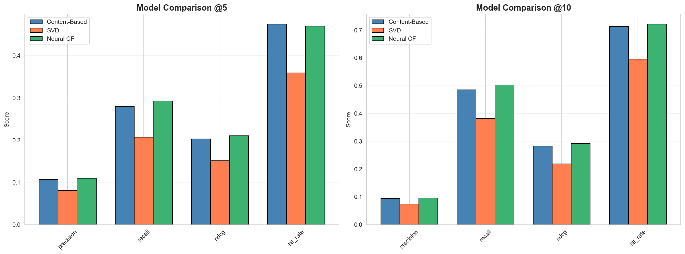
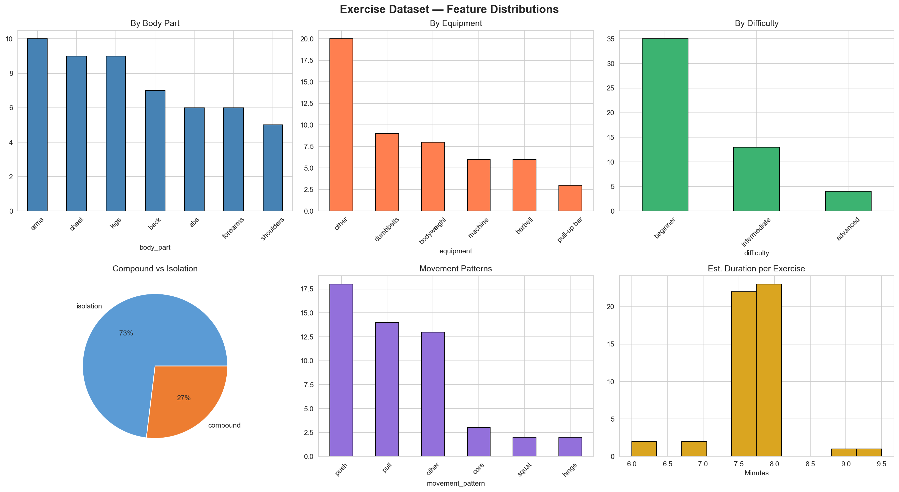
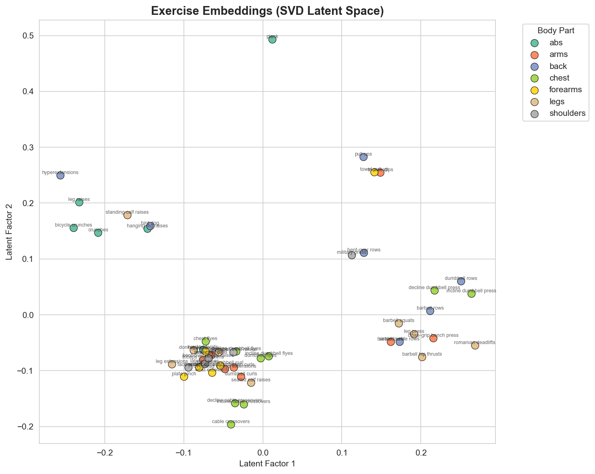
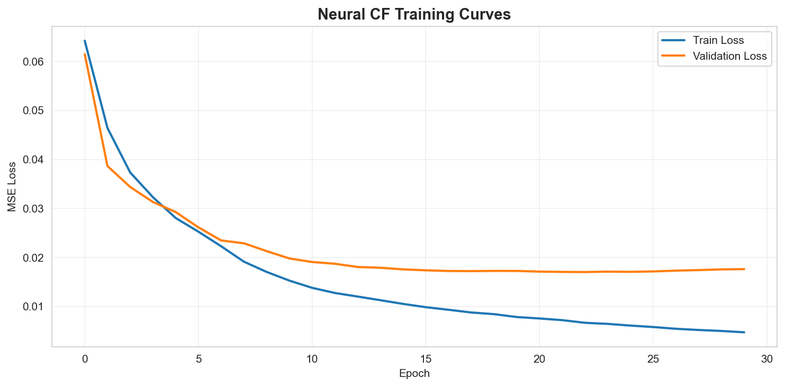

# FitRec: A Multi-Approach Fitness Workout Recommender

A machine learning project that recommends personalized workout plans by implementing and comparing three recommendation approaches: Content-Based Filtering, Collaborative Filtering (SVD), and Neural Collaborative Filtering (NCF).

## Project Overview

**Problem:** Given a user's fitness profile (goals, fitness level, available equipment, body focus preference), recommend a personalized set of exercises to form a workout plan.

**What makes this project stand out:**
- Implements and rigorously compares 3 distinct ML approaches on the same problem
- Engineers 8 new features from a 5-column dataset
- Generates realistic synthetic interaction data with documented preference rules
- Evaluates using standard ranking metrics (Precision@K, Recall@K, NDCG@K, Hit Rate@K)
- Includes detailed analysis of why each model performs the way it does

---

## Results

| Metric | Content-Based | SVD (Collaborative) | Neural CF | Best |
|--------|:------------:|:-------------------:|:---------:|:----:|
| Precision@5 | 0.1071 | 0.0810 | **0.1099** | NCF |
| Recall@5 | 0.2795 | 0.2067 | **0.2925** | NCF |
| NDCG@5 | 0.2029 | 0.1511 | **0.2103** | NCF |
| Hit Rate@5 | **0.4744** | 0.3591 | 0.4701 | CB |
| Precision@10 | 0.0937 | 0.0741 | **0.0953** | NCF |
| Recall@10 | 0.4857 | 0.3818 | **0.5025** | NCF |
| NDCG@10 | 0.2828 | 0.2184 | **0.2917** | NCF |
| Hit Rate@10 | 0.7138 | 0.5963 | **0.7214** | NCF |



---

## Key Takeaways

### Why Neural CF Wins (7/8 Metrics)
The Neural Collaborative Filtering model outperforms the other two approaches because it combines the strengths of both: it learns latent user-exercise embeddings (like SVD) while also capturing non-linear interaction patterns through its MLP layers. The dual-pathway architecture (GMF + MLP) gives it the flexibility to model both simple and complex preference signals.

### Why Content-Based Is a Close Second
Content-based filtering performs strongly because our synthetic interaction data was generated using content-based preference rules (e.g., beginners prefer easier exercises, bodyweight-only users can't use barbells). This gives the content-based model a natural "home court advantage" — it's essentially reverse-engineering the rules that created the data.

### Why SVD Struggles
SVD underperforms for two reasons: (1) The interaction matrix is relatively sparse (1,000 users × 51 exercises with only 15 interactions per user), giving SVD limited signal to learn from. (2) SVD can only capture linear relationships between latent factors, missing the non-linear patterns that Neural CF picks up.

### What Would Change with Real Data
With real-world interaction data, we'd expect collaborative and neural approaches to improve significantly, as they could discover preference patterns that aren't captured by content features alone — for example, users who do yoga might also prefer swimming, a relationship that content features wouldn't predict.

---

## Methodology

### Phase 1: Data Preparation
- **Dataset:** [The Ultimate Gym Exercises Dataset](https://www.kaggle.com/datasets/peshimaammuzammil/the-ultimate-gym-exercises-dataset-for-all-levels) — 51 exercises with body part, muscle type, sets, and reps
- **Feature Engineering:** Enriched from 5 to 13 columns by inferring equipment, movement type (compound/isolation), movement pattern (push/pull/squat/hinge/core), difficulty level, and estimated duration from exercise names and attributes
- **Synthetic Data:** Generated 1,000 user profiles and 15,000 user-exercise interactions using 5 documented preference rules (difficulty matching, equipment compatibility, body part preference, goal alignment, age adjustments)



### Phase 2: Model Implementation

**Model 1 — Content-Based Filtering:**
Encodes exercises as one-hot feature vectors and maps user profiles into the same feature space. Ranks exercises by cosine similarity. Handles cold-start users since no interaction history is needed.

**Model 2 — Collaborative Filtering (SVD):**
Builds a user-exercise interaction matrix, mean-centers ratings, and applies Truncated SVD to learn latent factors. Predicts ratings for unseen exercises by reconstructing the matrix from learned factors.



**Model 3 — Neural Collaborative Filtering:**
PyTorch model with dual pathways — GMF (element-wise embedding product, like matrix factorization) and MLP (concatenated embeddings through dense layers). Both pathways merge for final prediction. Architecture: 32-dim embeddings → MLP[64, 32, 16] with BatchNorm and Dropout.



### Phase 3: Evaluation
All three models evaluated on the same 80/20 train/test split using Precision@K, Recall@K, NDCG@K, and Hit Rate@K for K ∈ {5, 10}.

---

## Project Structure

```
fitness-recommender/
├── notebooks/
│   ├── 01_eda.ipynb                      # Exploratory Data Analysis & Feature Engineering
│   ├── 02_data_generation.ipynb          # Synthetic User & Interaction Generation
│   ├── 03_content_based.ipynb            # Content-Based Filtering Model
│   ├── 04_collaborative_filtering.ipynb  # SVD Matrix Factorization Model
│   └── 05_neural_cf.ipynb               # Neural Collaborative Filtering Model
├── data/
│   ├── raw/Workout.csv                   # Original dataset
│   └── processed/                        # Cleaned exercises, user profiles, interactions
├── results/
│   ├── figures/                          # All generated visualizations
│   └── metrics/                          # JSON files with evaluation results
├── src/
│   └── models/                           # Modular model code
├── requirements.txt
└── README.md
```

---

## How to Run

```bash
# Clone and setup
git clone https://github.com/Khaledel123/fitness-recommender.git
cd fitness-recommender
python3 -m venv venv
source venv/bin/activate
pip install -r requirements.txt

# Run notebooks in order (1-5) using Jupyter
jupyter notebook
```

---

## Tech Stack
- **Python 3.13** — Primary language
- **PyTorch** — Neural Collaborative Filtering model
- **scikit-learn** — SVD, preprocessing, evaluation utilities
- **pandas / NumPy** — Data manipulation
- **matplotlib / seaborn** — Visualizations
- **Jupyter** — Interactive experimentation

---

## Author
**Khaled Elkhaled** — Software Engineer

